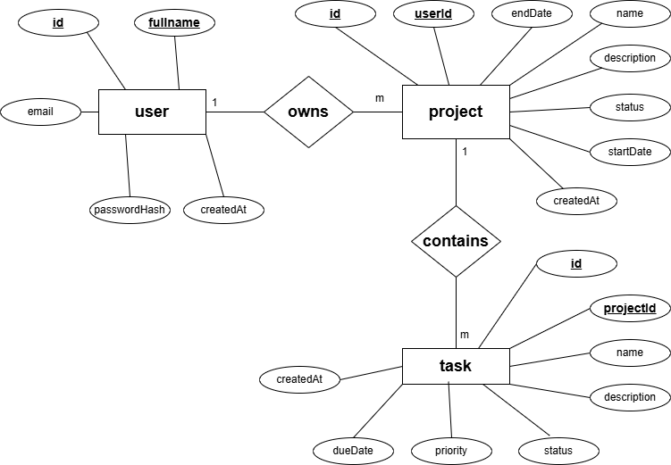

# Project Management App

Full-stack project and task management application built with React, Node.js/Express, and MySQL.

## Stack
- **Frontend**: React 19, React Router v7, Axios, react-hot-toast
- **Backend**: Node.js, Express, Sequelize, MySQL
- **Auth**: JWT (Bearer token) + bcryptjs password hashing

---

## Setup Instructions

### Prerequisites
- Node.js >= 18
- MySQL >= 8 

### 1. Database Setup
```bash
# Log into MySQL and run the schema file
mysql -u root -p < server/schema.sql
```

### 2. Backend
```bash
cd server
cp .env.example .env        # fill in your DB credentials and JWT secret
npm install
npm run dev                 # starts on http://localhost:5000
```

### 3. Frontend
```bash
cd client
npm install
npm start                   # starts on http://localhost:3000
```

---

## ER Diagram



---

## Environment Variables

### server/.env
| Variable        | Description                          | Example                  |
|-----------------|--------------------------------------|--------------------------|
| `PORT`          | Express server port                  | `5000`                   |
| `DB_HOST`       | MySQL host                           | `localhost`              |
| `DB_PORT`       | MySQL port                           | `3306`                   |
| `DB_NAME`       | Database name                        | `project_management`     |
| `DB_USER`       | MySQL username                       | `root`                   |
| `DB_PASSWORD`   | MySQL password                       | `your_password`          |
| `JWT_SECRET`    | Secret for signing JWTs              | `a_long_random_string`   |
| `JWT_EXPIRES_IN`| JWT expiry duration                  | `7d`                     |
| `NODE_ENV`      | Environment (`development`/`production`) | `development`        |

### client/.env
| Variable             | Description              | Default                        |
|----------------------|--------------------------|--------------------------------|
| `REACT_APP_API_URL`  | Backend API base URL     | `http://localhost:5000/api`    |

---

## Database Migration

Sequelize's `sequelize.sync()` in `server/index.js` creates tables automatically on startup if they don't exist. Alternatively, use the raw SQL:

```bash
mysql -u root -p project_management < server/schema.sql
```

---

## Design Decisions

| Decision | Choice | Reason |
|---|---|---|
| Token storage | `localStorage` | Simplest implementation; tradeoff is XSS exposure. An httpOnly cookie approach would be more secure in production. |
| ORM sync | `sequelize.sync()` | Sufficient for development; in production, use `sequelize-cli` migrations for schema versioning. |
| Pagination | None | Not specified in requirements; can be added by appending `LIMIT/OFFSET` via Sequelize's `limit`/`offset` options. |
| Task creation from global Tasks page | Project dropdown rendered dynamically | Allows creating tasks without navigating to a specific project page. |
| Error format | `{ error: string }` or `{ errors: [{field, message}] }` | Single shape for single errors; array shape for validation to enable field-level inline display. |
